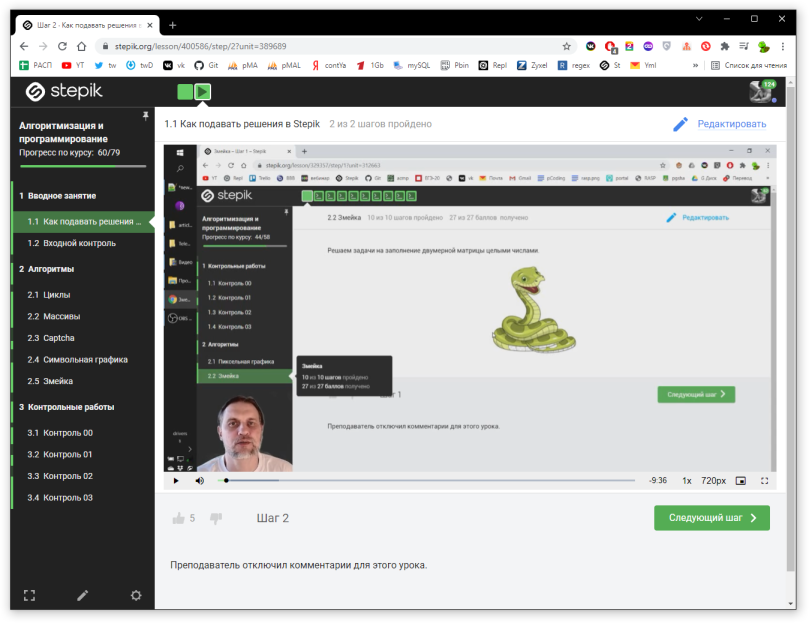
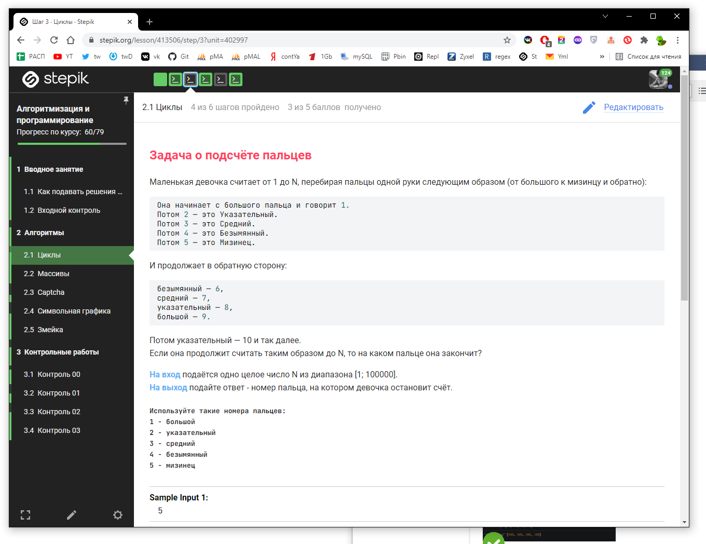

## ЛАБРАБ 08 - 29.10.2021  

Лабораторка - Контрольная работа №1,  
будет в автоматизированном режиме на платформе Stepik.  
***(Срок исполнения: до начала следующей лабораторки)***  

Зайдите вот в этот мой курс по ссылке:  
https://stepik.org/course/64867/syllabus  

Там нужно зарегаться, пригодиться и далее - можем там ещё несколько контрольных провести.  

Посмотрите для начала раздел "Как подавать решения в Stepik".  
Затем уже заходите в тему "Циклы" и там уже проводите свои решения - они автоматически сохраняются, я потом учту ваши достижения в рейтинге.  

  

  

  

---  
