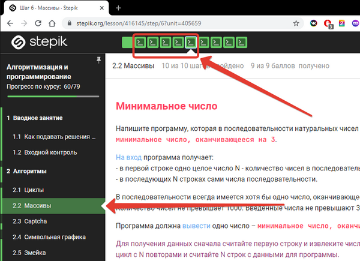
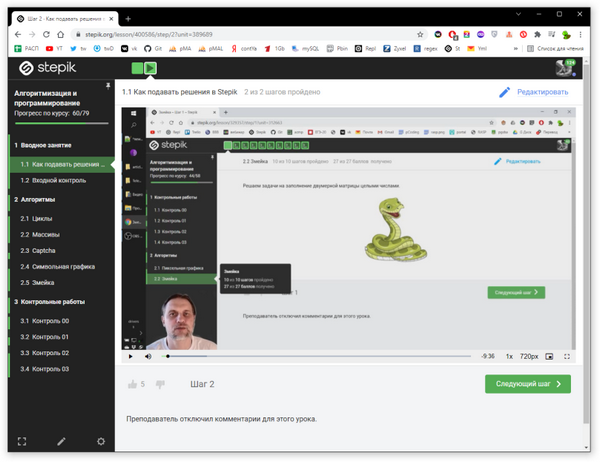

## ЛАБРАБ 09  

Контрольная работа №2 по теме "**Массивы**"  
будет в автоматизированном режиме на платформе Stepik.  
***(Срок исполнения: до начала следующей лабораторки)***  

Зайдите вот в этот мой курс по ссылке:  
https://stepik.org/course/64867/syllabus  

Или непосредственно сразу перейдите к теме Массивы вот по этой ссылке:  
https://stepik.org/lesson/416145/step/1?unit=405659  

**ВНИМАНИЕ! Нужно решать только первые 5 задач.**  

  

Если кому-то не ясно как именно подавать решения, то  
посмотрите для начала раздел "Как подавать решения в Stepik".  

  

---  
